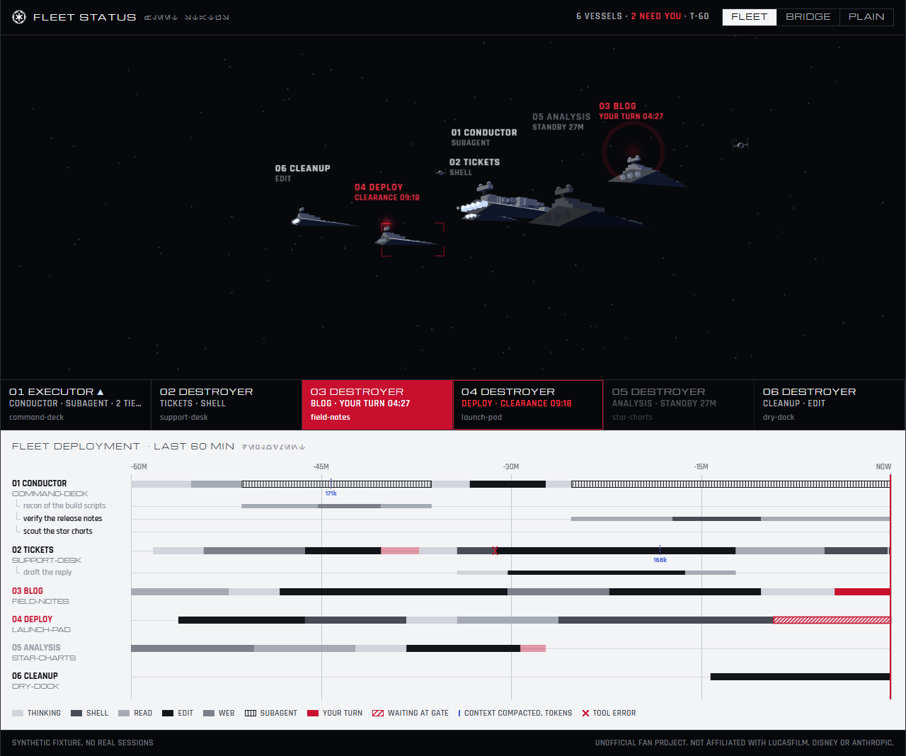
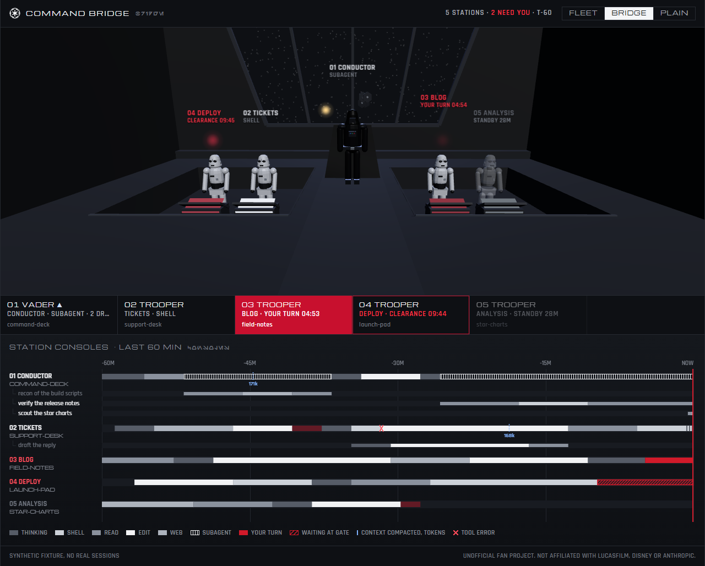
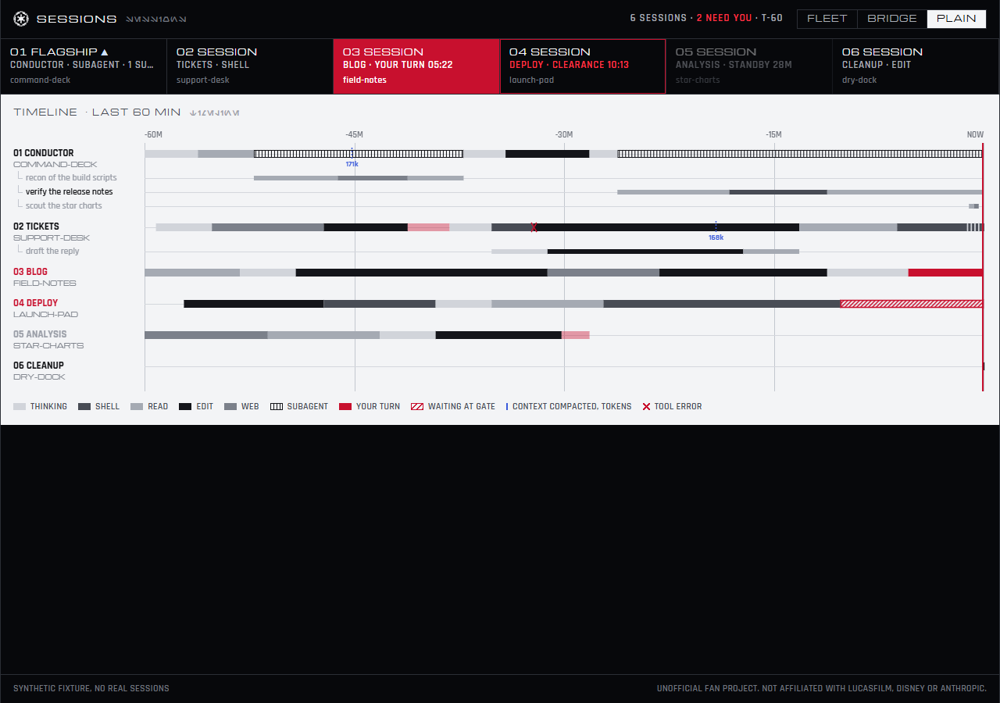

# death-squadron

A Star Wars live view of your Claude Code sessions. Read-only, local-only, one command.

Every ship, trooper and beacon stands for a real session state. Nothing on screen is decoration.



## Quick start

```
npx death-squadron
```

It prints a local URL and opens it in your browser. Leave it running in a spare terminal. Ctrl+C stops it.

Want to look before pointing it at your own sessions? `npx death-squadron --fixture` plays a scripted synthetic fleet with every state in it.

## Skins

**Fleet.** Each session is a Star Destroyer, the flagship is the Executor. Subagents launch as TIE fighters, patrol and dock when they finish. A session waiting on you flashes a red beacon, a finished session jumps to hyperspace.

**Bridge.** Each session is a stormtrooper at a console, the flagship is Vader at the window. Subagents are drones circling the station, and the console screen shows the state.



**Plain.** The same data without the 3D scene: status tiles and the timeline.



Every skin carries the lane timeline of the last 60 minutes: thinking, shell, read, edit, web and subagent spans per session, subagents nested underneath, context compactions with their token count, and tool errors.

| State | Fleet | Bridge |
|---|---|---|
| working | engines flicker bright | console flickers |
| thinking | engines pulse dim | screen pulses pale blue |
| your turn | red beacon and ring, YOUR TURN timer | red flashing screen and lamp |
| idle | hull dark, drifts back | trooper dims |
| ended | hyperspace jump | trooper walks off |
| subagent | TIE launch, patrol, dock | drone circles the station |
| message between sessions | bolt between ships | bolt between stations |
| compaction | shield flash | screen flashes blue |

"Your turn" means the last transcript line is a finished assistant turn and nothing has followed. A public package has no prompt reader and permission prompts never reach the transcript, so a session stuck on a permission prompt shows as working, not as waiting at the gate. The gate state exists in the view for readers that can see prompts.

## What it reads

- Reads only `~/.claude/sessions/*.json`, `~/.claude/projects/<enc>/<id>.jsonl` and `<id>/subagents/agent-*.jsonl` with its `.meta.json`. The sessions folder also holds `.key` files, and the reader globs `*.json` only and never opens them.
- A session counts as alive through `process.kill(pid, 0)`, which checks the process and sends no signal.
- No hooks. No writes to `settings.json`, `CLAUDE.md` or anything under `~/.claude`. The package writes no file anywhere, and view preferences live in the browser.
- No telemetry, no update check, no analytics. Fonts, three.js, the crest and any models ship inside the package. The only network traffic is the browser loading the bundle from `127.0.0.1`.
- The server binds `127.0.0.1`, never port 3001, and refuses requests whose Host header is not localhost, so a web page cannot reach it through DNS rebinding.
- No postinstall script and no native modules.

The full working directory of a session never leaves the process. The browser gets the last folder name only.

## Flags

```
--skin fleet|bridge|plain   start skin (default fleet, the browser remembers your pick)
--port <n>                  first port to try (default 7777, walks up to 7799, skips 3001)
--no-open                   print the URL, do not open a browser
--flagship <sessionId>      pin the flagship session
--claude-dir <path>         read another Claude folder (default: CLAUDE_CONFIG_DIR, then ~/.claude)
--idle-after <minutes>      how long "your turn" lasts before a session counts as idle (default 10)
--fixture                   synthetic demo fleet, reads nothing from disk
-h, --help / -v, --version
```

**Flagship rule.** The session whose working directory is the folder you launched from leads the fleet. Without one, the session with the most working subagents leads, then the most recently active one. `--flagship` overrides the rule, and clicking a status tile or a ship in the fleet promotes a session.

Controls: drag to orbit, wheel to zoom. In the fleet a click promotes and a double-click focuses, on the bridge a click focuses a station. The view pauses when the tab is hidden and the server stops reading until a tab is open again.

## Requirements

- Node 22 or newer
- A browser with WebGL (the plain skin works without it)

## Credits

- Transcript event model and lane timeline ported from [azorkai/claude-code-office](https://github.com/azorkai/claude-code-office) (MIT)
- Bounded transcript tailer ported from [Kostakurta8/roundtable](https://github.com/Kostakurta8/roundtable) (MIT)
- [three.js](https://threejs.org) (MIT)
- Aurebesh font by SilvinoR, Michroma and Rajdhani (SIL Open Font License 1.1)
- Empire crest from Font Awesome (CC BY 4.0)
- Ships, troopers and the bridge are procedural, built from primitives in code

Full notices: [THIRD_PARTY_NOTICES.md](THIRD_PARTY_NOTICES.md).

## Fan project

Unofficial, not affiliated with Lucasfilm, Disney or Anthropic. Star Wars names and designs belong to their owners.

If a rights holder asks for any part of this to come down, it comes down, no argument.

## Licence

The code is MIT, see [LICENSE](LICENSE).

## Maintainers

```
npm test
npm run typecheck
npm pack --dry-run
npm publish
```

`prepack` builds `dist/` and runs the leak guard over it, so `npm pack` and `npm publish` always ship a fresh, checked bundle. The git hooks (`npm run hooks` once after cloning) run the same guard on every commit and the tests before every push.

To rebuild the vendored transcript reader from its TypeScript source: `node scripts/vendor-core.js <live-core dir> <commit>`.
